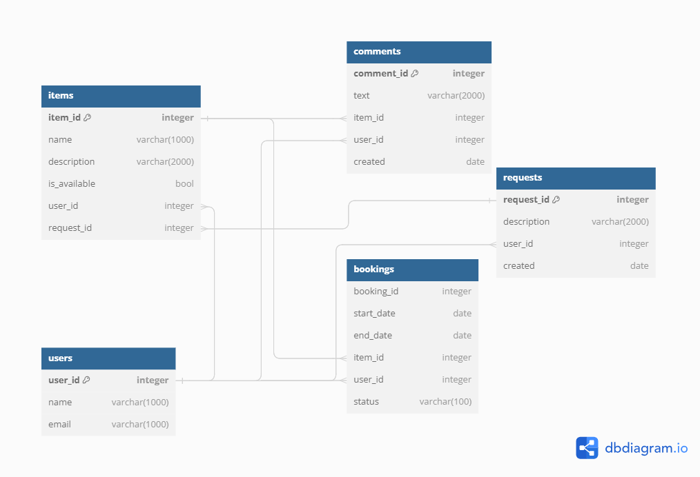

# JAVA-SHAREIT
### Шеринг-приложение, позволяющее делиться своими вещами и пользоваться чужими

---

При проектировании приложения была использована микросервисная архитектура с целью оптимизации потока 
запросов к серверу со стороны клиента путем внедрения первичной валидации передаваемых объектов. 

Приложение разделено на 2 блока:
- `gateway` - шлюз, через который проходят все запросы пользователей. 
Часть из запросов отсеивается именно тут в случае, если не были соблюдены условия валидации передаваемых объектов. 
Кроме того, шлюз преобразует первичные запросы к приложению в необходимую форму и с помощью интерфейса взаимодействия
между микросервисами направляет преобразованный HTTP-запрос на серверную часть.
- `server` - сервер, микросервис, содержащий в себе основную часть бизнес-логики. Здесь происходит вторичная валидация
передаваемых объектов, основанная на взаимодействии с базой данных, добавление, обновление и извлечение бизнес-сущностей
из базы данных, их преобразование из/в DTO-объекты.

Фактически каждый микросервис является отдельным приложением, которое запускается на отдельном порту. Этим обусловлен
характер их взаимодействия - с помощью REST-интерфейса.

Для облегчения процесса развертывания приложения в разных средах в качестве средства контейнеризации использован Docker. 
Приложение распределено по 3 контейнерам(db, gateway, server), которые работают на разных портах и взаимодействуют между 
собой также с помощью REST-интерфейса.

---

## БИЗНЕС-СУЩНОСТИ

Доменная область приложения представлена рядом центральных сущностей, участвующих в бизнес-процессах шеринговой компании.

### User
Сущность-пользователь, с помощью которой осуществляется взаимодействие с другими сущностями.

Включает поля:
- `id` - идентификатор пользователя (генерируется СУБД)
- `name` - имя пользователя
- `email`- адрес электронной почты пользователя

### Item
Сущность-вещь, содержащая в себе описание предмета, сдаваемого в аренду (главная сущность).

Включает поля:
- `id` - идентификатор вещи (генерируется СУБД)
- `name` - наименование предмета
- `description` - описание предмета
- `available` - флаг доступности предмета для аренды
- `owner` - объект пользователя-хозяина вещи
- `request` - объект запроса, в ответ на который вещь была добавлена

### ItemRequest
Сущность-запрос вещи пользователя, если подходящей на данный момент в приложении нет.

Включает поля:
- `id` - идентификатор запроса вещи (генерируется СУБД)
- `description` - описание запроса вещи
- `requester` - объект пользователя, оставившего запрос
- `created` - момент времени, в который был создан этот запрос вещи

### Comment
Сущность-комментарий к арендованной его автором вещи.

Включает поля:
- `id` - идентификатор комментария к вещи (генерируется СУБД)
- `text` - текст комментария
- `author` - объект пользователя, оставившего этот комментарий
- `item` - объект арендованного предмета, к которому пользователь оставил комментарий
- `created` - момент времени, в который был опубликован комментарий

### Booking
Сущность-бронирование предмета пользователем приложения.

Включает поля:
- `id` - идентификатор бронирования вещи (генерируется СУБД)
- `start` - момент начала бронирования
- `end` - момент окончания бронирования
- `item` - объект предмета, для которого отправлена заявка на бронирование/подтверждено бронирование
- `booker` - объект пользователя, отправившего заявку на бронирование
- `bookingStatus` - объект перечисления, включающий информацию о статусе этого бронирования

---

## ФУНКЦИОНАЛЬНОСТЬ

Функциональность сформирована в соответствии с особенностями доменной области. Условно её можно разделить на 4 части: 
пользователи, арендуемые вещи, запросы на отсутствующие в данный момент в приложении вещи, бронирования вещей.

### Пользователи

- Получение списка всех пользователей   `GET http://localhost:8080/users`
- Получение информации о пользователе по его id   `GET http://localhost:8080/users/{id}`
- Публикация информации о новом пользователе   `POST http://localhost:8080/users`
- Обновление информации о пользователе по его id   `PATCH http://localhost:8080/users/{id}`
- Удаление информации о пользователе по его id   `DELETE http://localhost:8080/users/{id}`

### Арендуемые вещи

- Получение списка всех арендуемых вещей пользователя по его id(заголовок запроса)   `GET http://localhost:8080/items`
- Получение списка арендуемых вещей, которые содержат в своем наименовании или описании передаваемую в параметрах запроса подстроку постранично   `GET http://localhost:8080/items/search?text={text}&from={from}&size={size}`
- Получение информации об арендуемой вещи по её id   `GET http://localhost:8080/items/{id}`
- Публикация информации о новой арендуемой вещи   `POST http://localhost:8080/items`
- Публикация комментария пользователем, который арендовал вещь   `POST http://localhost:8080/items/{itemId}/comment`
- Обновление информации об уже существующей арендуемой вещи по её id   `PATCH http://localhost:8080/items/{itemId}`

### Запросы вещей

- Получение списка запросов вещей пользователя по его id(заголовок запроса)   `GET http://localhost:8080/requests`
- Получение списка всех запросов вещей постранично   `GET http://localhost:8080/requests/all?from={from}&size={size}`
- Получение информации о запросе вещи по его id   `GET http://localhost:8080/requests/{id}`
- Публикация информации о новом запросе вещи   `POST http://localhost:8080/requests`
- Обновление информации об уже существующем запросе вещи по его id   `PATCH http://localhost:8080/requests/{requestId}`

### Бронирования вещей

- Получение списка бронирований пользователя по его id(заголовок запроса) в состоянии state постранично   `GET http://localhost:8080/bookings?state={state}&from={from}&size={size}`
- Получение списка бронирований вещей пользователя по его id(заголовок запроса) в состоянии state постранично   `GET http://localhost:8080/bookings/owner?state={state}&from={from}&size={size}`
- Получение информации о бронировании вещи по его id   `GET http://localhost:8080/bookings/{id}`
- Публикация информации о новом бронировании вещи   `POST http://localhost:8080/bookings`
- Обновление информации об уже существующем бронировании вещи по его id   `PATCH http://localhost:8080/bookings/{bookingId}`